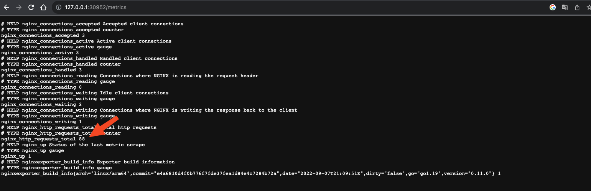
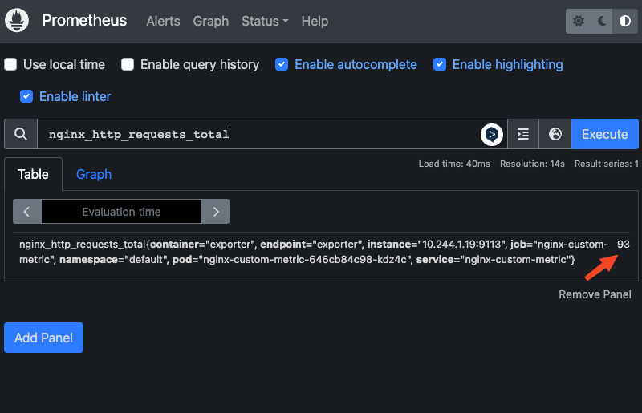

# 1. 개요
* 쿠버네티스 HPA와 keda 연습
* 전제조건: metrics server 원리를 알고 있어야 함
  * blog참고: https://malwareanalysis.tistory.com/659

<br>

# 2. 환경 구축
* make install로 환경구축 자동화
* 설치 목록
  * kind 클러스터 생성
  * metrics-server

```bash
make install
```

<br>

# 3. 환경 삭제
* kind 클러스터 삭제

```bash
make uninstall
```

<br>

# 4. custom 메트릭 실습
## 4.1 custom metrics 조회
* custom metrics을 조회하면, custom metrics API가 없기 때문에 에러 발생

```bash
$ kubectl get --raw "/apis/custom.metrics.k8s.io/v1beta1"
Error from server (NotFound): the server could not find the requested resource
```

* custom.metrics api가 없는 것을 확인

```bash
$ kubectl get apiservices | grep "custom"
```

## 4.2 prometheus adatper 설치
* external metrics server 역할을 하는 prometheus adatper 설치

```bash
$ make install-prometheus-adapter
$ kubectl -n default get pod
NAME                                             READY   STATUS    RESTARTS   AGE
metrics-sevrer-metrics-server-7649d7fd47-vv4g7   1/1     Running   0          49m
prometheus-adapter-6fdf67fb84-rmwt2              1/1     Running   0          46s
```

* custom metrics을 조회
* prometheus를 설치하지 않았기 때문에 resources가 null

```bash
$ kubectl get --raw "/apis/custom.metrics.k8s.io/v1beta1"
{"kind":"APIResourceList","apiVersion":"v1","groupVersion":"custom.metrics.k8s.io/v1beta1","resources":[]}
```

## 4.3 prometheus operator 설치
* custom metrics을 가져오기 위해 prometheus operator설치
```bash
$ make install-prometheus-operator
$ kubectl -n default get pod -l "release=operator"
NAME                                                   READY   STATUS    RESTARTS   AGE
operator-kube-prometheus-s-operator-54b9654c4f-4gnvq   1/1     Running   0          34s
operator-kube-state-metrics-67bcd4df86-hns7w           1/1     Running   0          34s
operator-prometheus-node-exporter-6zl7k                1/1     Running   0          34s
operator-prometheus-node-exporter-tpzxw                1/1     Running   0          34s
```

* custom.metrics api 조회

```bash
$ kubectl get apiservices | grep "custom"
v1beta1.custom.metrics.k8s.io          default/prometheus-adapter              True        55m
```

* custom metrics을 조회

```bash
$ kubectl get --raw "/apis/custom.metrics.k8s.io/v1beta1" | jq . | more
{
  "kind": "APIResourceList",
  "apiVersion": "v1",
  "groupVersion": "custom.metrics.k8s.io/v1beta1",
  "resources": [
    {
      "name": "services/go_memory_classes_heap_objects_bytes",
      "singularName": "",
      "names
  ...
}
```

<br>

# 5. custom 메트릭과 HPA 예제
## 5.1 nginx pod, service, servicemonitor, hpa 배포
* 예제 디렉터리에 있는 manifest 배포

```bash
$ ls ./examples/01_nginx_custom_metrics
configmap.yaml      deployment.yaml     hpa.yaml            service.yaml        servicemonitor.yaml
```

```bash
kubectl apply -f ./examples/01_nginx_custom_metrics/
```

## 5.2 nginx metric 확인
* nginx nodeport: http://127.0.0.1:30951
* nginx metrics nodeport: http://127.0.0.1:30952/metrics
* http://127.0.0.1:30951를 호출할 때마다 reqeust_count가 1 증가



## 5.3 prometheus에서 nginx 메트릭 확인
* prometheus nodeport: http://127.0.0.1:30950



## 5.4 nginxcustom metrics 설정 추가
* [proemtheus-adatper 설정](./helm_values/prometheus-adatper.yaml)에서 rules 주석 해제
* prometheus adatper helm upgrade

```bash
install-prometheus-adapter
```

## 5.5 커스텀 메트릭 등록 확인
* 커스컴 메트릭 목록에 nginx_http_requests_total가 있는지 확인

```bash
$ kubectl get --raw "/apis/custom.metrics.k8s.io/v1beta1" | jq .
{
  "kind": "APIResourceList",
  "apiVersion": "v1",
  "groupVersion": "custom.metrics.k8s.io/v1beta1",
  "resources": [
    {
      "name": "jobs.batch/nginx_http_requests_total",
      "singularName": "",
      "namespaced": true,
      "kind": "MetricValueList",
      "verbs": [
        "get"
      ]
    },
    {
      "name": "namespaces/nginx_http_requests_total",
      "singularName": "",
      "namespaced": false,
      "kind": "MetricValueList",
      "verbs": [
        "get"
      ]
    },
    {
      "name": "pods/nginx_http_requests_total",
      "singularName": "",
      "namespaced": true,
      "kind": "MetricValueList",
      "verbs": [
        "get"
      ]
    },
    {
      "name": "services/nginx_http_requests_total",
      "singularName": "",
      "namespaced": true,
      "kind": "MetricValueList",
      "verbs": [
        "get"
      ]
    },
  ]
}
```

## 5.6 커스텀 메트릭 값 조회
* nginx_http_requests_total 커스텀 메트릭이 추가되었는지 확인

```bash
kubectl get --raw "/apis/custom.metrics.k8s.io/v1beta1/namespaces/default/service/nginx-custom-metric/nginx_http_requests_total" | jq .
{
  "kind": "MetricValueList",
  "apiVersion": "custom.metrics.k8s.io/v1beta1",
  "metadata": {},
  "items": [
    {
      "describedObject": {
        "kind": "Service",
        "namespace": "default",
        "name": "nginx-custom-metric",
        "apiVersion": "/v1"
      },
      "metricName": "nginx_http_requests_total",
      "timestamp": "2023-10-09T13:31:58Z",
      # metric value
      "value": "160",
      "selector": null
    }
  ]
}
```

## 5.7 HPA 확인
* 시간이 지나면 nginx probe때문에 request_count자동 증가
* request_count가 50이상이면 HPA 이벤트 발생

```bash
$ kubectl -n default get hpa nginx-custom-metric
Events:
  Type    Reason             Age   From                       Message
  ----    ------             ----  ----                       -------
  Normal  SuccessfulRescale  57s   horizontal-pod-autoscaler  New size: 3; reason: pods metric nginx_http_requests_total above target
```

<br>

# 6. KEDA

## 6.1 전제조건
* prometheus operator가 설치되어 있어야 함

```bash
# prometheus operator 설치
make install-prometheus-operator
```

## 6.2 KEDA 배포

```bash
$ make install-keda
$ kubectl -n keda get po
NAME                                               READY   STATUS    RESTARTS        AGE
keda-admission-webhooks-5458b867ff-qrrl4           1/1     Running   0               2m59s
keda-operator-785546b5d7-ps2lw                     1/1     Running   1 (2m49s ago)   2m59s
keda-operator-metrics-apiserver-6f68c4d7dc-lqg9r   1/1     Running   0               2m59s
```

## 6.3 예제 배포

```bash
kubectl apply -f ./examples/02_keda_example
```

## 6.4 prometheus에서 metric 수집되는지 확인
* prometheus nodeport: http://127.0.0.1:30950
* 확인해야하는 메트릭: nginx_http_requests_total

## 6.5 keda 리소스 조회
* crd ScaledObject조회

```bash
$ kubectl -n default get ScaledObject nginx-keda-example
NAME                 SCALETARGETKIND      SCALETARGETNAME      MIN   MAX   TRIGGERS     AUTHENTICATION   READY   ACTIVE   FALLBACK   PAUSED    AGE
nginx-keda-example   apps/v1.Deployment   nginx-keda-example   1     5     prometheus                    True    False    False      Unknown   2m41s
```

* ScaleObject는 HPA를 생성하고 관리

```bash
kubectl -n default get hpa
NAME                          REFERENCE                       TARGETS      MINPODS   MAXPODS   REPLICAS   AGE
keda-hpa-nginx-keda-example   Deployment/nginx-keda-example   0/50 (avg)   1         5         1          4m27s
```

## 6.6 keda 리소스 디버깅
* keda operator pod 로그 조회: "value: 250"

```bash
kubectl -n keda logs -f -l app=keda-operator
2023-10-09T15:57:02Z	DEBUG	scale_handler	Getting metrics from scaler	{"scaledObject.Namespace": "default", "scaledObject.Name": "nginx-keda-example", "scaler": "prometheusScaler", "metricName": "s0-prometheus", "metrics": [{"metricName":"s0-prometheus","metricLabels":null,"timestamp":"2023-10-09T15:57:02Z","value":"250"}], "scalerError": null}
```

# 참고자료
* [github] prometheus adapter: https://github.com/kubernetes-sigs/prometheus-adapter/blob/master/docs/walkthrough.md
* [blog] custom and external metrics: https://medium.com/uptime-99/kubernetes-hpa-autoscaling-with-custom-and-external-metrics-da7f41ff7846
* [blog] rancher prometheus adatper configruation: https://ranchermanager.docs.rancher.com/v2.0-v2.4/explanations/integrations-in-rancher/cluster-monitoring/custom-metrics#querying
* [blog] nginx metrics: https://velog.io/@sojukang/%EC%84%B8%EC%83%81%EC%97%90%EC%84%9C-%EC%A0%9C%EC%9D%BC-%EC%89%AC%EC%9A%B4-Prometheus-Grafana-%EB%AA%A8%EB%8B%88%ED%84%B0%EB%A7%81-%EC%84%A4%EC%A0%95-NGINX%ED%8E%B8
* [blog] custom nginx prometheus adatper request_per_second configruation: https://medium.com/ibm-cloud/autoscaling-applications-on-openshift-container-platform-3-11-with-custom-metrics-6e9c14474de3
* [blog] custom postgres prometheus adatper request_per_second configruation https://www.postgresql.fastware.com/knowledge-base/how-to/installing-the-prometheus-adapter
* [blog] custom metrics HPA configuration: https://vsoch.github.io/2023/autoscaling-v2/
